# PrestigeProperties Dashboard

## Overview
PrestigeProperties Dashboard is a web application for managing real estate leads.  
It allows agents to add leads and to track conversations, notes, and the status of each lead while providing VIP and qualified lead insights.  
The app integrates with Supabase as the backend database, n8n for automation workflows, and twilio as messaging service for Whatsapp conversations.

## Architecture

### Components
- **Web App (Next.js)**: Frontend for displaying leads, conversations, and notes.
- **Supabase**: Stores leads, conversations, and notes.
- **n8n**: Automation workflows to handle new leads and classifying clients.
- **Twilio**: Handles Whatsapp interactions.

### Data Flow Diagram

```mermaid
flowchart TD
    A[🚀 Next.js Dashboard] -->|HTTP POST Lead Data| B[🌐 n8n Webhook]
    B -->|Validate & Transform| C[💾 Save to Supabase]
    C -->|Trigger on New Row| D[🤖 WhatsApp Automation]
    D -->|Send Welcome Message| E[📱 Lead's WhatsApp]
    E -->|Lead Responds| F[🔄 Two-way Communication]
    F -->|Update Status| G[📊 Real-time Dashboard]
    
    subgraph "Supabase Database"
        H[leads table]
        I[messages table]
    end
    
    C --> H
    D --> I
    F --> I
    G -.->|Live Updates| H
    
    style A fill:#000,color:#fff
    style B fill:#5a67d8,color:#fff
    style C fill:#3ecf8e,color:#fff
    style D fill:#25d366,color:#fff
    style E fill:#25d366,color:#fff
    style F fill:#075e54,color:#fff
```


## Design Decisions

We used Twilio as our main messaging service because its easy to use and support sms and whatsapp,
telegram bot couldn't be used because it needs the client to initiate the conversations which is not optimal for business.

We used three tables Conversations, Leads, Notes to keep all the interactions between the lead and the ai agent saved.

And for the prompting the AI and its persona, we made sure its as professional and respectful as possible and we added a little bit of warmth to it to make it more human.

## Setup Instructions

```bash
# 1. Clone the repository
git clone https://github.com/oussa023/PrestigeProperties.git
cd PrestigeProperties/prestige-properties

# 2. Install dependencies
nvm install --lts
npm install

# 3. Create environment variables
# Copy the environment template
cp .env.example .env.local

# Edit .env.local with your credentials
nano .env.local  # or use any text editor

# 4. Run the development server
npm run dev

# 5. Open the app in your browser
# Navigate to http://localhost:3000

# Optional: Build and run for production
npm run build
npm start

# 7. Optional: Messaging Service Setup
# Add your credentials to .env.local if using messaging:
echo "TWILIO_ACCOUNT_SID=your_twilio_sid" >> .env.local
echo "TWILIO_AUTH_TOKEN=your_twilio_auth_token" >> .env.local

# 8. Optional: Set up n8n (automation workflows)
npm install -g n8n
n8n start

# Configure workflows to integrate with Supabase or messaging services as needed
# 9. Optional: Auto-refresh and live updates
# The app polls for new leads and notes every 10 seconds by default. No additional setup is required.


